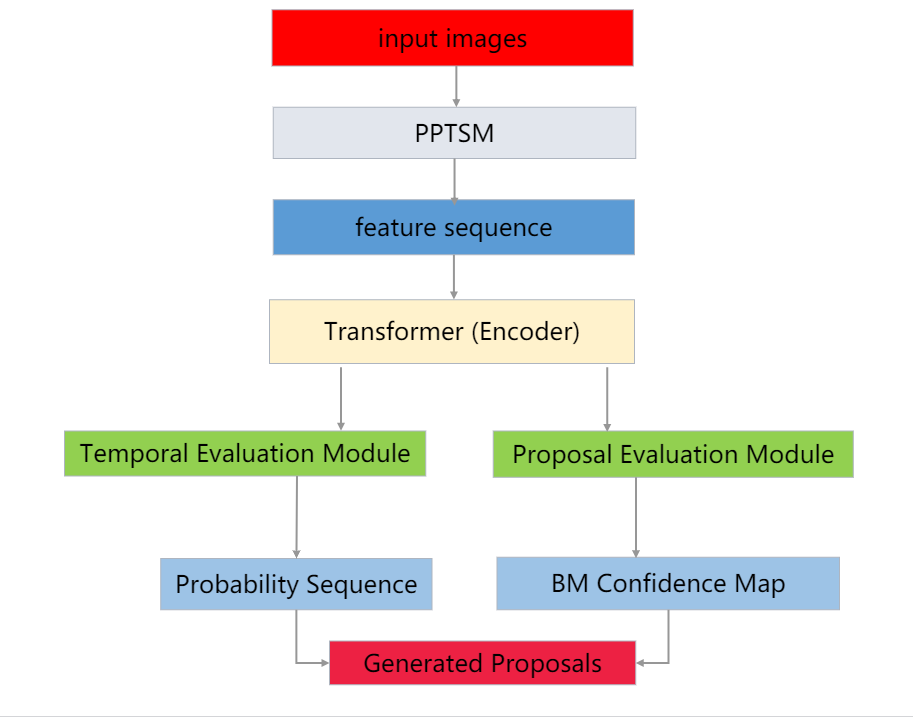

# 基于飞桨实现乒乓球时序动作定位大赛 ：B榜第17名方案

## 比赛介绍+赛题重点难点剖析

本次比赛的任务为对乒乓球转播画面中面对镜头的运动员的挥拍动作进行定位(时序动作提案生成)。并且，本次比赛要求使用飞桨框架完成模型开发、训练与优化。

乒乓球与其他运动项目相比，其动作类型的区分难度更大，这对识别任务来说是极大的挑战。对于乒乓球动作定位任务，主要难点如下：

(1) 乒乓球远动员的挥拍动作很难通过一帧或几帧图像中的人物姿态去定位动作发生的时间；
(2) 乒乓球远动员某些小幅度挥拍动作和非挥拍动作的区别仅存于某几帧的细微差异，判别难度较高；
(3) 乒乓球远动员的挥拍动作只需要很短时间，通常小于1秒，这对定位模型的敏感度要求级高；
(4) 本次比赛所使用的数据输入为ppTSM抽取的视频特征（连续帧特征)，定位模型可使用的**数据形式会受到约束**；

## 数据介绍+数据处理过程

本实验采用的数据集包含了19-21赛季兵乓球国际比赛（世界杯、世锦赛、亚锦赛，奥运会）和国内比赛（全运会，乒超联赛）中标准单机位高清转播画面的特征信息，共包含912条视频特征文件，每个视频时长在0～6分钟不等，特征维度为2048，以pkl格式保存。该数据集对特征数据中面朝镜头的运动员的回合内挥拍动作进行了标注，单个动作时常在0～2秒不等，训练数据为729条标注视频，我们使用的是B测数据，其有92条视频，其由视频帧率、视频名称、总帧数和空的动作。训练数据标签以json格式给出，其由视频帧率、视频名称、总帧数、动作类型编号、动作类型、动作起始时间和结束时间组成。

本实验提供的数据是**将每个视频以4秒为单位进行分割的，其帧率为25，所以每个视频有100帧。**输入数据为ppTSM抽取的视频特征（连续帧特征)。双流网络在视频动作识别中精确率较高，并且双流网络在视频分析领域有着广泛的应用，而ppTSM是双流网络的变体，在一定程度上可以更好的提取视频的特征，其中每个用作特征提取的视频帧单元成为一个snippet，包含图像帧和rgb光流等。

对于数据处理，首先加载视频特征数据、获取匹配图以及视频标签。然后通过继承paddle的Dataset API来构建数据读取器，方便每次从数据中获取一个样本和对应的标签。输入包括数据路径、数据处理的pipeline、数据集、是否是测试模式。每条数据包括视频特征、真值的交并比图 、真值的开始、真值的结束时间。对于测试集多一个视频索引。以不同的起点和长度构建时序特征序列，这里起始点从0到0.99，长度是从0.01到1，构成了100 ∗ 100 个时序序列，同时构建起始点和结束点锚。这样对于时序序列和真值的时间序列计算iou得到真值的交并比图；对于真值的起始和结束点会在对应的起始和结束点周围扩展范围，然后计算构建的起始点和结束点的锚与真值的起始结束点的分别计算ioa，进而得到开始的匹配分数和结束的匹配分数。

## 思路介绍+个人方案亮点

本次比赛我们是基于百度的BMN模型进行修改的，BMN模型是一个运行高效、性能优秀的，且由纯卷积组成的模型。它在前人的工作上做了许多改进，提名特征提取以及置信度评估的过程是并行的，使其效率得到大大的提升。此外，还在语义丰富性上做了很大的改进。但是BMN模型其实是非常简单的，在网络设计和优化方面还存在着不小的提高空间。由此，我们从网络设计方面着手，对基础模块部分进行了优化，将其原有的纯卷积层替换为可以注意更多信息的Transformer架构，实现更加丰富的时序语义信息融合。

## 具体方案

模型主要由编码器、时序评估模块、提议评估模块三部分组成。我们首先基础模块对原始的特征进行处理，然后用时序评估模块去定位时序动作片段的边界的概率序列，即开始边界和结束边界概率，最后所有可能的提议生成置信度图。

上图可以用公式描述如下，对于时序特征序列$S_F\in R^{C \times T} $,我们有
$$
Q=S_F  W_q \quad K=S_F W_k\quad V=S_F W_v \\
V'=softmax(\frac{QK^T}{\sqrt C})V+V \\
FFN(V')=Linear(Dropout(ReLu(Linear(V')))) \\
S_F'=FFN(V')+V'
$$
encoder模块作为主干网络处理输入的特征序列，用于扩大感受野，其输入的视频特征序列的维度是（16，400，100），经过两个一维卷积后，输出的特征维度为（16，256，100）。后面的模块实现方式基本上与BMN模型一致。

时序评估模块是用于评估视频中所有位置是起点或者终点的概率，其输入维度为（16，256，100），经过一个一维卷积进行时间融合之后，再进行一次一维卷积来改变通道数，最后分别进行一次一维卷积层对每个位置上的动作开始概率和动作结束概率进行建模，从而生成动作开始概率序列和动作结束概率序列。最后的输出维度分别为（16，256，100）、（16，256，100）。

提议评估模块是用于生成边界匹配置信度图，对每个提议生成其置信度分数。提议评估模块的输入维度是（16，256，100），经过两个一维卷积得到边界匹配层，将其输出的特征与掩码矩阵进行相乘再输出得到边界匹配特征图，再经过2个三位卷积和8个二维卷积来消除采样维度，得到边界置信度图，其输出维度为（16，2，100，100）。

最后，损失函数主要包括时序评估损失, 提名生成回归损失和提名生成分类损失。其中时序评估损失由开始边界的损失和结束边界的损失构成，采用weighted binary logistic regression损失函数。PEM损失为二分类损失和回归损失之和。在计算损失函数时，我们会先对样本进行分类，做均衡处理。

负样本然后计算weighted binary logistic regression loss，因为该loss比较小，所以乘以weight=10；第二块reg_loss，选取gt_iou_map大于0.7是正样本，小于0.3负样本，计算weighted mse loss，最终loss是这几类loss相加

## 总结+改进完善方向

本方案将基础模块换成了Transformer的Encoder模块（即BERT），因为基础模块是使用的一维卷积，用于扩大感受野，其用一维卷积的感受野有限，无法考虑整个序列的信息。为此，我们选用了Transformer的Encoder部分来关注更多的信息，以此取代基础模块。

## 飞将使用体验以及学习飞桨的建议

第一次使用飞桨的时候，感觉和pytorch很像，但慢慢上手后，发现其有许多pytorch没有的优点，感觉paddle paddle的一些API和接口，在使用时更人性化，有些类的封装做的很好，比喻分布式训练做得比较好。它是国内唯一的集深度学习训练和预测框架、模型库、工具组件等为一体的开源深度学习平台，所以在学习资源方面也易获取，学习起来更方便快捷，并且平台也提供了一些CPU、GPU环境可以免费使用。

对于从头开始学习深度学习，基于飞桨的教材是十分推荐的，毕竟是国内首个主流的深度学习框架，在文档API查看上更具优势，其他文档都是英文的，对于初学者不太友好，所以学习的时候建议理论结合代码。

## 参考论文（资料）

1. [[ICCV 2019\][时序动作提名] 边界匹配网络详解 - 知乎林天威](https://zhuanlan.zhihu.com/p/75444151)
2. [[ECCV 2018\] 用于时序动作提名生成的边界敏感网络 - 知乎林天威](https://zhuanlan.zhihu.com/p/39327364)
3. [Lin_BMN_Boundary-Matching_Network_for_Temporal_Action_Proposal_Generation_ICCV_2019_paper.pdf](https://web.kamihq.com/web/viewer.html?state={"ids"%3A["1e8hJpccuIDiHPPoh7KzKq4voOH3rsWoM"]%2C"action"%3A"open"%2C"userId"%3A"112930524677024684354"}&filename=Lin_BMN_Boundary-Matching_Network_for_Temporal_Action_Proposal_Generation_ICCV_2019_paper.pdf&kami_user_id=30782939)
4. [基于飞桨实现乒乓球时序动作定位大赛-baseline - 知乎](https://zhuanlan.zhihu.com/p/460937971)
5. [Tianwei_Lin_BSN_Boundary_Sensitive_ECCV_2018_paper.pdf](https://web.kamihq.com/web/viewer.html?source=extension_pdfhandler&extension_handler=extension_open_button&file=https%3A%2F%2Fopenaccess.thecvf.com%2Fcontent_ECCV_2018%2Fpapers%2FTianwei_Lin_BSN_Boundary_Sensitive_ECCV_2018_paper.pdf&referer=https%3A%2F%2Fopenaccess.thecvf.com%2Fcontent_ECCV_2018%2Fhtml%2FTianwei_Lin_BSN_Boundary_Sensitive_ECCV_2018_paper.html)
6. [Lin_Learning_Salient_Boundary_Feature_for_Anchor-free_Temporal_Action_Localization_CVPR_2021_paper.pdf](https://web.kamihq.com/web/viewer.html?state={"ids"%3A["1lheShxfLuGg1htvN-R1IyXFc7v5DJK7n"]%2C"action"%3A"open"%2C"userId"%3A"112930524677024684354"}&filename=undefined&kami_user_id=30782939)
7. [时序动作检测(Temporal Action Detection)论文总结 - Zexian Li](https://funian788.github.io/post/temporal-action-detection-papers/#评价指标)
8. [Zeng_Graph_Convolutional_Networks_for_Temporal_Action_Localization_ICCV_2019_paper.pdf](https://web.kamihq.com/web/viewer.html?source=filepicker&document_identifier=a61223c4-5287-4693-9af3-5d841db7da8b&filename=Zeng_Graph_Convolutional_Networks_for_Temporal_Action_Localization_ICCV_2019_paper.pdf)
9. RecapNet Action Proposal Generation Mimicking.pdf
10. [P-GCN: Graph Convolutional Networks for Temporal Action Localization](https://arxiv.org/abs/1911.11462)
11. [时序动作检测模型 — MMAction2 0.21.0 文档](https://mmaction2.readthedocs.io/zh_CN/latest/localization_models.html)
12. [API 文档-API文档-PaddlePaddle深度学习平台](https://www.paddlepaddle.org.cn/documentation/docs/zh/api/index_cn.html)

